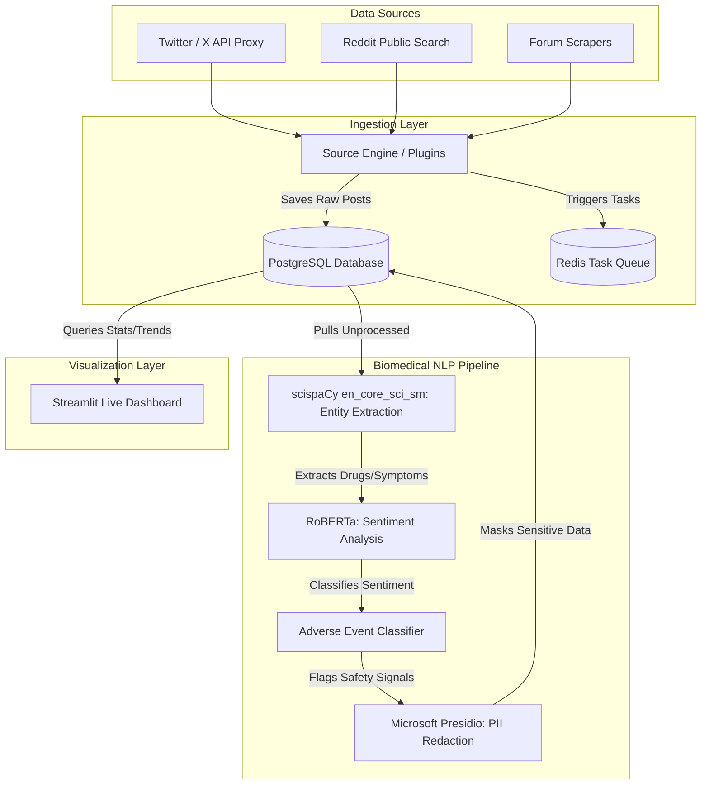

# DrishtiAI — Patient Safety Signal Intelligence

Real-time social listening platform that monitors Twitter, Reddit, and online forums for patient-reported adverse drug events and safety signals — surfacing risks weeks before they appear in formal pharmacovigilance reports.

Updated working links:

Dashboard:
https://drishti-ai-1.onrender.com

API Docs:
https://drishti-ai-szyx.onrender.com/docs

## What It Does
- Ingests tweets and posts mentioning drugs, symptoms, and conditions in real time
- Runs a 4-stage biomedical NLP pipeline: entity extraction → sentiment → adverse event detection → PII flagging
- Detects adverse drug events with confidence scoring and explainable AI (SHAP-style reasoning)
- Automatically masks PII/PHI in all dashboard views — DPDP Act compliant by design
- Agentic source discovery — AI agent searches the web for new patient communities and forums automatically
- Live dashboard with signal feed, trend charts, and one-click source onboarding

## AI Pipeline
| Stage | Model / Tool | Purpose |
|-------|-------------|---------|
| Named Entity Recognition | scispaCy `en_core_sci_sm` | Extract drugs, symptoms, conditions |
| Sentiment Analysis | cardiffnlp/twitter-roberta-base-sentiment | Social media-aware sentiment |
| Adverse Event Detection | Rule-based classifier + sentiment signals | Flag safety-critical posts |
| PII/PHI Flagging | Microsoft Presidio | Detect and mask personal identifiers |
| Source Discovery | DuckDuckGo Search Agent | Auto-discover new monitoring sources |

## Tech Stack
Python, FastAPI, PostgreSQL, Redis, scispaCy, cardiffnlp RoBERTa, Microsoft Presidio, Streamlit, Plotly, twitterapi.io, PRAW, DuckDuckGo Search, APScheduler, Docker Compose

## Architecture



### System Component Breakdown
1. **Data Sources**: Multi-channel listening inputs pulling from the public Reddit search engine, Twitter API, and direct web scrapers.
2. **Ingestion & Storage**: A plugin-based ingestion framework executing database transactions via PostgreSQL. Includes Redis task queuing for background worker concurrency.
3. **Biomedical NLP Pipeline**: A multi-stage processing pipeline:
   * **scispaCy**: Named Entity Recognition (NER) to extract medical entities like drugs, symptoms, and dosages.
   * **RoBERTa**: Sentiment classifier to rank patient-reported frustrations.
   * **Adverse Event (AE) Detection**: Core classifier that tags posts showing critical adverse drug events.
   * **Microsoft Presidio**: Replaces sensitive identifiers (Aadhaar cards, phone numbers, personal names) with redacted masks to fulfill DPDP compliance.
4. **Visualization Layer**: Interactive Streamlit Dashboard rendering live signal feeds, trend charts, and source discovery actions.

## Setup

> [!TIP]
> **Note for Reviewers (Zero Setup Required)**: 
> When the backend boots up for the first time against an empty database, it **automatically seeds 5 realistic patient adverse event posts** and processes them through the biomedical NLP pipeline (scispaCy + RoBERTa + Presidio). The Streamlit dashboard will be fully populated with charts, redacted PII metrics, and explanations out-of-the-box, without requiring you to set up any API keys or trigger manual ingestions!

### Prerequisites
- Docker Desktop
- Python 3.10+

### Run
```bash
# Start database and Redis
docker compose up -d

# Install dependencies
cd backend
pip install -r requirements.txt
pip install https://s3-us-west-2.amazonaws.com/ai2-s3-scispacy/releases/v0.5.4/en_core_sci_sm-0.5.4.tar.gz

# Add your API keys
cp .env.example .env
# Edit .env and add TWITTER_API_KEY

# Start API server
uvicorn main:app --reload

# Start dashboard (new terminal)
venv\Scripts\python.exe -m streamlit run dashboard.py
```

### Environment Variables
- `DATABASE_URL` = Local postgres URL, or Render database URL (the app automatically converts public hostnames to internal hostnames to prevent SSL drops).
- `REDIS_URL` = Local Redis URL, or Render Key-Value internal URL.
- `TWITTER_API_KEY` = Optional premium Twitter API key (from twitterapi.io).
- `REDDIT_USER_AGENT` = Custom user agent header (e.g. `DrishtiAI/1.0`) to retrieve live Reddit posts for free without API keys.

## Ingestion Engines
1. **Reddit Engine (Public Search API)**: A 100% free search index querying public subreddits for side-effects and drug reviews in real-time. Requires no registration or credentials.
2. **Twitter Engine (advanced_search)**: Connects to a paid Twitter search proxy when configured.

## API Endpoints
| Method | Endpoint | Description |
|--------|----------|-------------|
| POST | `/ingest/test` | Fetch posts from Twitter |
| POST | `/process` | Run NLP pipeline on unprocessed posts |
| GET | `/signals/feed` | Signal feed with full NLP results |
| GET | `/signals/stats` | Summary statistics |
| GET | `/signals/trends` | Trend data for charts |
| GET | `/discover` | Agentic source discovery |

## India-Specific Design
- PII detection includes Aadhaar number patterns
- Adverse event classifier handles Hinglish and Indian drug brand names
- DPDP Act compliant — no raw author data stored, all PII masked
- Designed for CDSCO/PvPI integration for post-market surveillance

## Contributors
- Himanshu Menghani — https://github.com/524himanshu
- Sweety Saha — https://github.com/sahasweety

## Hackathon
AI for Bharat 2026 — Theme 6: Real-Time Social Listening for Patient Experience & Safety Signals
PAN IIT Bangalore Alumni Association × Government of Karnataka
